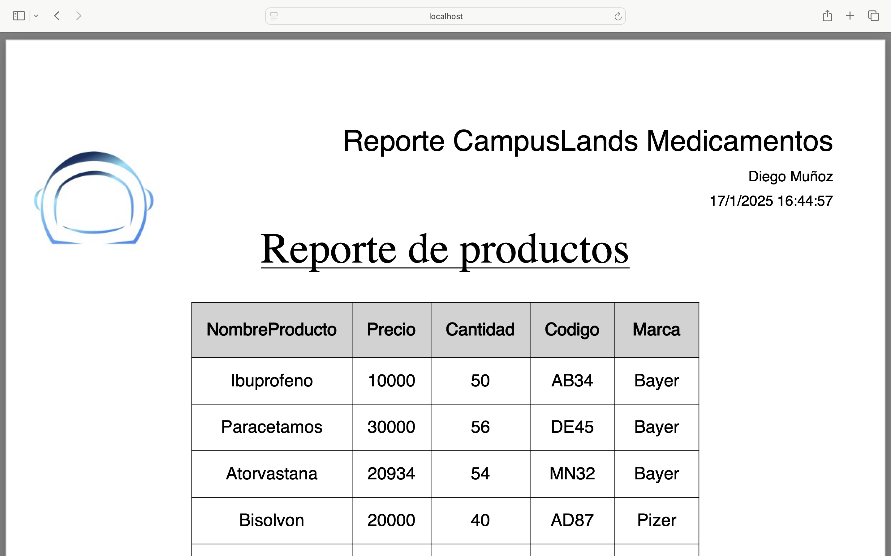
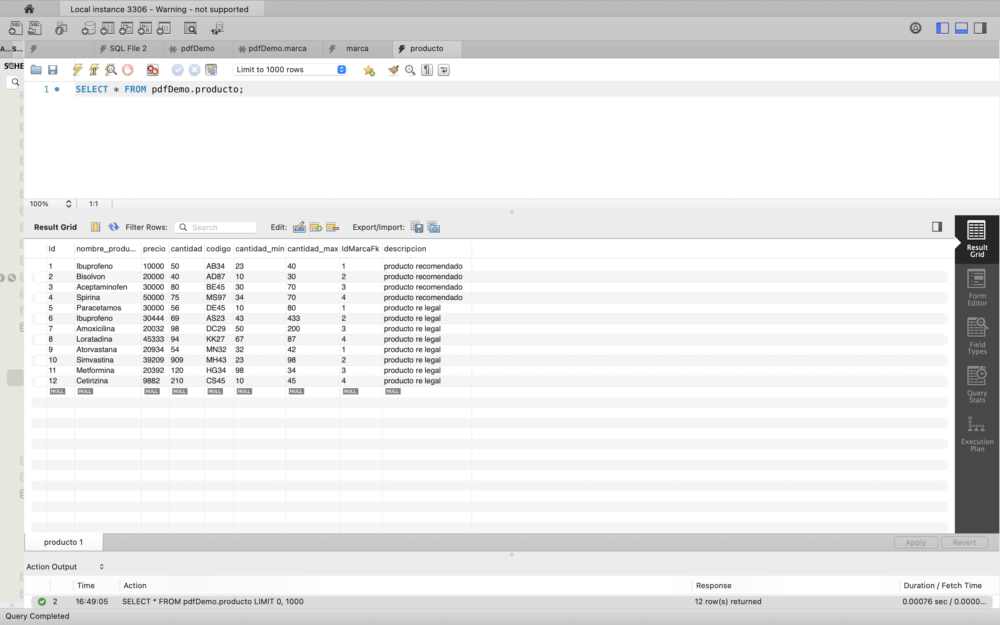

# Proyecto de Generación de PDF con .NET 7 y MySQL

Este proyecto es una API desarrollada con **.NET 7** que permite generar un archivo **PDF** dinámicamente utilizando los datos de una base de datos MySQL. La API utiliza varias bibliotecas, incluyendo **iText7**, **iTextSharp**, y otras para la manipulación y creación del PDF. Los datos necesarios se extraen de una base de datos MySQL a través de una capa de acceso a datos utilizando un patrón de unidad de trabajo.



### Requisitos

- **.NET 7.0**
- **MySQL** como base de datos.


- Paquetes NuGet:

```xml
<PackageReference Include="itext7" Version="8.0.1" />
<PackageReference Include="itext7.bouncy-castle-adapter" Version="8.0.1" />
<PackageReference Include="iTextSharp" Version="5.5.13.3" />
<PackageReference Include="Swashbuckle.AspNetCore" Version="6.5.0" />
<PackageReference Include="BouncyCastle" Version="1.8.*" />
```

### Instalación y ejecución

- **Clona el repositorio:**
Si no tienes el proyecto en tu máquina, clónalo desde el repositorio Git correspondiente (o descarga el archivo ZIP si es necesario).

- git clone <https://github.com/Alejomdi193/PDFDEMO.git>
- cd <PDFDEMO./API>

### Instala las dependencias:

Asegúrate de que tu entorno tenga .NET 7.0 instalado. Si no lo tienes, puedes instalarlo desde el sitio oficial de .NET.

Una vez instalado .NET 7.0, abre la terminal en el directorio del proyecto y ejecuta:

- dotnet restore

### Configura la base de datos:

Asegúrate de que tu base de datos MySQL esté configurada correctamente.
Asegúrate de tener las tablas necesarias con los datos que deseas consultar para generar los informes en PDF.
Si utilizas Entity Framework, asegúrate de configurar correctamente la conexión a la base de datos en el archivo **appsettings.json**.

### Ejecuta la aplicación:

Inicia el servidor de la API usando el siguiente comando:
- **dotnet run**
El servidor estará escuchando en http://localhost:5003 (puede variar dependiendo de tu configuración).

### Genera el PDF:

Una vez que la API esté corriendo, puedes generar un PDF haciendo una solicitud GET al siguiente endpoint:
**http://localhost:5003/producto/pdf**
Esto devolverá un archivo PDF con los datos extraídos de la base de datos. Puedes agregar parámetros en la URL para filtrar o paginar los resultados si lo deseas.

### Descripción del Proyecto
El proyecto incluye las siguientes funcionalidades:

-**Generación de PDFs:** Utiliza las bibliotecas iText7 y iTextSharp para crear PDFs dinámicos con los datos extraídos desde una base de datos MySQL.
Los encabezados del PDF se configuran utilizando fuentes y alineación.
Los datos se insertan en una tabla con formato adecuado.
-**Extracción de datos de MySQL:** Se utiliza un patrón de unidad de trabajo (IUnitOfWork) para interactuar con la base de datos y obtener los productos o datos requeridos.
-**API RESTful:** La API expone un endpoint para generar el archivo PDF. Puedes modificar este endpoint según sea necesario.
El controlador ProductoController maneja la lógica para recuperar los productos, mapearlos a DTOs (Data Transfer Objects), y generar el PDF.
-**Paginación y filtrado:** La API permite paginar y filtrar los resultados de la consulta de productos mediante parámetros en la URL.

### Tecnologías y Paquetes Utilizados
-**.NET 7.0:** El framework utilizado para construir la API y manejar la lógica de negocios.
-**MySQL:** Base de datos utilizada para almacenar y recuperar los productos.
-**iText7:** Biblioteca principal para generar archivos PDF.
-**iTextSharp:** Complemento para manejar la creación y manipulación de documentos PDF.
-**BouncyCastle:** Biblioteca para proporcionar capacidades de seguridad en la generación de PDF.
-**Swashbuckle.AspNetCore:** Utilizado para generar la documentación de la API a través de Swagger.

### Endpoints
-**GET /producto/pdf:**
Genera un archivo PDF con los productos almacenados en la base de datos.
-**Parámetros disponibles:**
-**pageIndex:** Número de la página de resultados.
-**pageSize:** Número de productos por página.
-**search:** Palabra clave para buscar productos específicos.

### Ejemplo de Solicitud GET
Para obtener el PDF con productos de la base de datos, puedes hacer una solicitud como la siguiente:

GET http://localhost:5003/producto/pdf?pageIndex=1&pageSize=10&search=medicamento
Este endpoint devolverá un archivo PDF con los productos que coincidan con la búsqueda "medicamento", limitando la respuesta a 10 productos por página.

### Notas
Asegúrate de tener la base de datos MySQL funcionando y con los datos necesarios antes de intentar generar los PDFs.
El proyecto está diseñado para funcionar con .NET 7.0 y utiliza paquetes de iText7 para la creación de archivos PDF.
Puedes personalizar el formato y contenido del PDF según las necesidades de tu aplicación.

### Contribuciones
Si deseas contribuir a este proyecto, siéntete libre de hacer un fork y enviar tus mejoras o correcciones. Abierto a sugerencias de optimización y nuevos features.

### Licencia
Este proyecto está bajo la Licencia MIT. Consulta el archivo LICENSE para más detalles.


